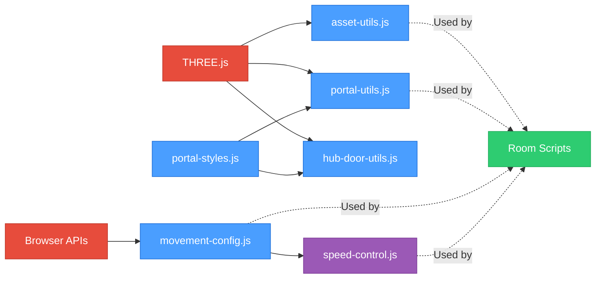

# NFT Gallery – Code Dependencies & Architecture

**Last Updated:** 2025-11-17
**Purpose:** Complete dependency map showing "who depends on whom" for the entire gallery codebase.

---

## Table of Contents

1. [Layered Architecture View](#1-layered-architecture-view)
2. [Core Module Dependencies](#2-core-module-dependencies)
3. [Room-Level Dependency Analysis](#3-room-level-dependency-analysis)
4. [Runtime Flow Per Room](#4-runtime-flow-per-room)
5. [Dependency Graph (Mermaid)](#5-dependency-graph-mermaid)
6. [Import Verification Table](#6-import-verification-table)
7. [Dependency Patterns & Anti-Patterns](#7-dependency-patterns--anti-patterns)

---

## 1. Layered Architecture View

### 1.1 Conceptual Layers

From bottom (most fundamental) to top (most application-specific):

```
┌─────────────────────────────────────────┐
│         HTML Shells (Entry Points)      │  ← room0.html, room1.html, etc.
│         - Load ES6 modules via Vite     │
│         - Provide DOM structure         │
└─────────────────────────────────────────┘
                    ↓
┌─────────────────────────────────────────┐
│      Room Scripts (Content Layer)       │  ← main.js, room2.js, room6.js, etc.
│      - Define geometry & layout         │
│      - Position NFTs & portals          │
│      - Room-specific gameplay           │
└─────────────────────────────────────────┘
                    ↓
┌─────────────────────────────────────────┐
│        UI Layer (/src/ui)               │  ← speed-control.js
│        - User interface overlays        │
│        - Speed slider, HUD elements     │
└─────────────────────────────────────────┘
                    ↓
┌─────────────────────────────────────────┐
│      Core Engine (/src/core)            │  ← movement-config.js, portal-utils.js,
│      - Shared game systems              │     asset-utils.js, portal-styles.js
│      - Movement, portals, assets        │
└─────────────────────────────────────────┘
                    ↓
┌─────────────────────────────────────────┐
│   THREE.js / Browser APIs (External)    │  ← PointerLockControls, WebGL, DOM
│   - 3D rendering library                │
│   - Browser primitives                  │
└─────────────────────────────────────────┘
```

### 1.2 Dependency Direction Rules

**✓ Allowed:**
- Rooms → Core utilities
- Rooms → UI components
- UI components → Core utilities
- Core utilities → THREE.js

**✗ Forbidden:**
- Core utilities → Rooms (would create circular dependencies)
- Core utilities → UI components (separation of concerns)
- UI components → Rooms (UI should be generic)

---

## 2. Core Module Dependencies

### 2.1 Dependency Graph (Core Only)

```
External Dependencies
│
├─→ THREE.js
│   ├─→ asset-utils.js
│   ├─→ portal-utils.js
│   ├─→ hub-door-utils.js
│   └─→ (all room files)
│
└─→ Browser APIs (window, document, localStorage)
    └─→ movement-config.js
        └─→ speed-control.js

Config-Only Modules (no dependencies)
│
├─→ portal-styles.js
│   ├─→ portal-utils.js
│   └─→ hub-door-utils.js
│
└─→ movement-config.js
    └─→ speed-control.js

Centralized Helpers (Phase 1-3 Refactoring)
│
├─→ scene-setup.js
│   └─→ (Used by: main.js, room2-5.js, room8.js)
│
├─→ nft-viewer.js
│   └─→ (Used by: main.js, room2-5.js)
│
└─→ collision-helpers.js
    └─→ (Used by: main.js, room2.js)
```

### 2.2 Core Modules in Detail

---

#### **scene-setup.js** (`/src/core/scene-setup.js`) ✅ NEW (Phase 1)

**Purpose:** Centralized scene, camera, renderer, and PointerLock controls initialization

**Dependencies:**
```javascript
import * as THREE from 'three';
import { PointerLockControls } from 'three/examples/jsm/controls/PointerLockControls.js';
```

**Exports:**
```javascript
export function initScene(options)
```

**Usage:**
```javascript
const { scene, camera, renderer, controls } = initScene({
  spawnPosition: { x: 0, y: 2.5, z: 0 },
  background: 0x000000,
  outputEncoding: 'sRGB',  // or 'Linear'
  fog: { color: 0x000000, near: 10, far: 100 }  // optional
});
```

**Used By:**
- `main.js` (Room 1)
- `room2.js`
- `room3.js`
- `room4.js`
- `room5.js`
- `room8.js`

**Benefits:**
- Eliminates ~30 lines of duplicated setup code per room
- Ensures consistent spawn behavior (no teleport jitter)
- Handles resize events automatically
- Manages controls overlay show/hide logic

---

#### **nft-viewer.js** (`/src/core/nft-viewer.js`) ✅ NEW (Phase 2)

**Purpose:** Unified NFT click overlay with raycasting, navigation, and metadata display

**Dependencies:**
```javascript
import * as THREE from 'three';
```

**Exports:**
```javascript
export function initNFTViewer(config)
```

**Usage:**
```javascript
const nftViewer = initNFTViewer({
  scene,
  camera,
  controls,
  renderer,
  nftMeshes,           // Array of THREE.Mesh objects with userData.isNFT
  nftMetadata,         // [{ id, url, title, description }]
  checkPortalProximity,  // optional callback to pause portal checks
  onOpen: () => {},    // optional
  onClose: () => {}    // optional
});
```

**Used By:**
- `main.js` (Room 1)
- `room2.js`
- `room3.js`
- `room4.js`
- `room5.js`

**Benefits:**
- Eliminates ~80-120 lines of viewer code per room (~400 lines total)
- Standardizes NFT metadata format across rooms
- Consistent overlay UI/UX (navigation arrows, close button, OpenSea links)
- Portal-aware (pauses portal proximity checks when viewer open)

---

#### **collision-helpers.js** (`/src/core/collision-helpers.js`) ✅ NEW (Phase 3)

**Purpose:** Reusable collision constraint functions for rectangular bounds and divider walls

**Dependencies:**
```javascript
// None (pure math functions)
```

**Exports:**
```javascript
export function applyOuterWallCollision(position, bounds)
export function applyDividerCollision(position, config)
```

**Usage:**
```javascript
// Outer walls:
applyOuterWallCollision(position, {
  minX: -10, maxX: 10,
  minZ: -50, maxZ: 0,
  radius: 0.5
});

// Divider walls:
applyDividerCollision(position, {
  dividerX: { min: -2, max: 2 },
  frontLimit: 1.0,
  backLimit: -1.0
});
```

**Used By:**
- `main.js` (Room 1) - Uses both helpers
- `room2.js` - Uses both helpers (calls applyDividerCollision twice for dual dividers)

**Benefits:**
- Eliminates ~30-40 lines of collision code per room
- Preserves exact behavior (no regressions)
- Room-specific constants remain in room files (good separation)
- Extensible for additional collision patterns (tile-based, death zones)

---

#### **asset-utils.js** (`/src/core/asset-utils.js`)

**Purpose:** Centralized asset path construction and diagnostic texture loading

**Dependencies:**
```javascript
import * as THREE from 'three';
```

**Exports:**
```javascript
// Diagnostic loading (advanced)
export function loadTextureWithDiagnostics(loader, url, options)
export function createFallbackMaterial(color, options)
export function logTextureLoadingSummary(textures, context)
export function batchLoadTextures(loader, urls, options)

// Configuration
export const ASSET_CONFIG = {
  basePath: '/assets/',
  format: 'webp',
  fallbackFormat: 'png'
}

// Path builders (most commonly used)
export function getTextureUrl(relativePathWithoutExt)
export function getNftUrl(nftNumber)
export function getRoomBNftUrl(index)
export function getRoom7ArtUrl(filename)
export function getRoomXNftUrl(platformNumber)
export function getRoomCNftUrl(nftNumber)
```

**Used By:**
- `main.js` (Room 1): getNftUrl
- `room2.js`: getNftUrl
- `room5.js`: getNftUrl
- `roomB.js`: All diagnostic functions + getRoomBNftUrl
- `roomC.js`: getNftUrl

**Key Pattern:**
```javascript
// Instead of hardcoding:
textureLoader.load('/assets/nft42.webp', ...)

// Use helper:
import { getNftUrl } from './src/core/asset-utils.js';
textureLoader.load(getNftUrl(42), ...)
```

---

#### **portal-styles.js** (`/src/core/portal-styles.js`)

**Purpose:** Centralized visual style configuration for all room-to-room portals

**Dependencies:** None (pure configuration)

**Exports:**
```javascript
// Color palette
export const PORTAL_COLORS = {
  CYAN: 0x00ffff,
  MAGENTA: 0xff00ff,
  GOLD: 0xffd700,
  // ... 20+ predefined colors
}

// Effect types
export const FX_TYPES = {
  PULSING_GLOW: 'pulsing-glow',
  ROTATING_RINGS: 'rotating-rings',
  PARTICLE_STREAM: 'particle-stream',
  STATIC_GLOW: 'static-glow'
}

// Style definitions
export const PORTAL_STYLES = {
  '0->1': { color: PORTAL_COLORS.CYAN, fx: FX_TYPES.PULSING_GLOW },
  '1->2': { color: PORTAL_COLORS.EMERALD, fx: FX_TYPES.ROTATING_RINGS },
  // ... 40+ portal style definitions
}

// Getters
export function getPortalStyle(fromRoom, toRoom)
export function getPortalStylesForRoom(roomId)
export function validatePortalStyles()
```

**Used By:**
- `portal-utils.js`: To apply consistent styling to all portals
- `hub-door-utils.js`: To style premium 3D doors in Room 0
- `room5.js`: Direct import for custom portal styling

**Design Philosophy:**
- Single source of truth for all portal visuals
- Changing "Room 3 → Room 4" portal color = 1 line edit
- Ensures visual consistency across the entire gallery

---

#### **portal-utils.js** (`/src/core/portal-utils.js`)

**Purpose:** Reusable portal creation, animation, and proximity detection

**Dependencies:**
```javascript
import * as THREE from 'three';
import { getPortalStyle, FX_TYPES } from './portal-styles.js';
```

**Exports:**
```javascript
// Portal creation
export function createPortal(options)
export function createLinkedPortal(options)  // Most commonly used
export function createPortalLabel(scene, options)

// Animation
export function animatePortal(portal, glow, speed)
export function animateLinkedPortal(portal, glow)  // Most commonly used

// Proximity detection & teleportation
export function createPortalProximityChecker(options)
export function createMultiPortalChecker(options)  // Most commonly used

// Legacy color constant (deprecated, use portal-styles.js)
export const PORTAL_COLORS = { ... }
```

**Used By:**
- `main.js` (Room 1): createLinkedPortal, animateLinkedPortal, createMultiPortalChecker
- `room2.js`: createLinkedPortal, animateLinkedPortal, createMultiPortalChecker
- `room5.js`: createLinkedPortal, createPortalLabel, animateLinkedPortal, createMultiPortalChecker
- `room6.js`: createLinkedPortal, animateLinkedPortal, createMultiPortalChecker

**Typical Usage Pattern:**
```javascript
// 1. Create portal visual
const { portal, glow } = createLinkedPortal({
  scene,
  fromRoom: '3',
  toRoom: '4',
  x: 0,
  y: eyeHeight,
  z: -25,
  rotationY: 0,
  createLabel: true
});

// 2. Create proximity checker
const checkPortalProximity = createMultiPortalChecker({
  camera: controls.getObject(), // IMPORTANT: Use controls, not camera
  portals: [{
    position: new THREE.Vector3(0, eyeHeight, -25),
    name: 'Room 4',
    url: 'room4.html',
    showDistance: 3.0,
    triggerDistance: 1.8
  }],
  controlsId: 'controls-description',
  overlayId: 'loading-overlay'
});

// 3. In animate() loop
animateLinkedPortal(portal, glow);
checkPortalProximity();
```

---

#### **hub-door-utils.js** (`/src/core/hub-door-utils.js`)

**Purpose:** Premium 3D door structures for Room 0 (Ocean Hub) instead of simple portals

**Dependencies:**
```javascript
import * as THREE from 'three';
import { getPortalStyle } from './portal-styles.js';
```

**Exports:**
```javascript
export function createHubDoor(options)
export function animateHubDoor(doorObj, time)
```

**Used By:**
- `room0.js` (likely, not verified in this analysis)

**Design Notes:**
- Creates architectural door frames instead of floating circles
- Uses same visual styles from portal-styles.js
- Includes label, proximity detection, and teleportation logic

---

#### **movement-config.js** (`/src/core/movement-config.js`)

**Purpose:** Per-room movement speed configuration with user multiplier

**Dependencies:** None (pure configuration with event system)

**Exports:**
```javascript
export const MOVEMENT_CONFIG = {
  BASE_SPEED: 60.0,  // Default if room not in map
  speedMultiplier: 1.0,  // User adjustment (0.5x - 2.0x)

  getEffectiveSpeed(roomKey) {
    // Returns: ROOM_BASE_SPEED[roomKey] * speedMultiplier
  },

  setSpeedMultiplier(value) {
    // Updates multiplier and fires 'speedChanged' event
  }
}
```

**Internal (not exported):**
```javascript
const ROOM_BASE_SPEED = {
  room1: 40.0,   // Slow (classic gallery)
  room2: 50.0,   // Slow
  room3: 60.0,   // Medium
  room4: 60.0,   // Medium
  room5: 60.0,   // Medium
  room6: 60.0,   // Medium (lava corridor)
  room7: 50.0,   // Slow (heavy art wall)
  room8: 60.0,
  room9: 60.0,
  room10: 6.0    // Very slow (vertical tower with jump physics)
}
```

**Used By:**
- `speed-control.js`: To set user multiplier
- `main.js` (Room 1): getEffectiveSpeed('room1')
- `room2.js`: getEffectiveSpeed('room2')
- `room5.js`: getEffectiveSpeed('room5')
- `room6.js`: getEffectiveSpeed('room6')

**Typical Usage Pattern:**
```javascript
import { MOVEMENT_CONFIG } from './src/core/movement-config.js';

// In animate() loop:
const delta = clock.getDelta();
const speed = MOVEMENT_CONFIG.getEffectiveSpeed('room6') * delta;

if (moveForward) velocity.z -= direction.z * speed;
if (moveRight) velocity.x -= direction.x * speed;
```

---

#### **speed-control.js** (`/src/ui/speed-control.js`)

**Purpose:** User-facing speed adjustment UI (slider + mouse wheel)

**Dependencies:**
```javascript
import { MOVEMENT_CONFIG } from '../core/movement-config.js';
```

**Exports:**
```javascript
export function initSpeedControl()
```

**Used By:**
- `main.js` (Room 1)
- `room2.js`
- `room5.js`

**Features:**
- Top-right on-screen slider (0.5x - 2.0x)
- Mouse wheel binding (Shift+Wheel for finer control)
- localStorage persistence across sessions
- Real-time speed adjustment without page reload

**Initialization Pattern:**
```javascript
import { initSpeedControl } from './src/ui/speed-control.js';

// After scene setup:
initSpeedControl();
```

**DOM Structure Created:**
```html
<div id="speed-control" style="position: fixed; top: 10px; right: 10px;">
  <label>Speed: <span id="speed-value">1.0x</span></label>
  <input type="range" id="speed-slider" min="0.5" max="2.0" step="0.1" value="1.0">
</div>
```

---

## 3. Room-Level Dependency Analysis

### 3.1 Full Dependency Verification

#### **Room 0 (room0.js)** - Ocean Hub
**Status:** Not fully analyzed in this session
**Expected Dependencies:**
- THREE.js + PointerLockControls
- hub-door-utils.js (for premium 3D doors to Rooms A, B, C)
- portal-utils.js (for portal to Room 1)
- asset-utils.js (for ocean/water textures)
- movement-config.js
- speed-control.js

---

#### **Room 1 (main.js)** - Classic Gallery ✓ VERIFIED (Phase 1-3 Refactored)
**Import Statement:**
```javascript
import * as THREE from 'three';
import { PointerLockControls } from 'three/examples/jsm/controls/PointerLockControls.js';
import { createLinkedPortal, animateLinkedPortal, createMultiPortalChecker } from './src/core/portal-utils.js';
import { getNftUrl } from './src/core/asset-utils.js';
import { MOVEMENT_CONFIG } from './src/core/movement-config.js';
import { initSpeedControl } from './src/ui/speed-control.js';
import { initScene } from './src/core/scene-setup.js';  // ✅ Phase 1
import { initNFTViewer } from './src/core/nft-viewer.js';  // ✅ Phase 2
import { applyOuterWallCollision, applyDividerCollision } from './src/core/collision-helpers.js';  // ✅ Phase 3
```

**Dependencies:**
- **THREE.js**: Scene, Camera, Renderer, Raycaster, TextureLoader, geometries, materials
- **scene-setup.js**: ✅ initScene() for scene/camera/renderer/controls setup
- **nft-viewer.js**: ✅ initNFTViewer() for unified NFT click overlay
- **collision-helpers.js**: ✅ applyOuterWallCollision(), applyDividerCollision()
- **portal-utils.js**: Portal creation and proximity checking for Room 0 ↔ Room 1 ↔ Room 2
- **asset-utils.js**: getNftUrl() for loading NFT textures
- **movement-config.js**: getEffectiveSpeed('room1') for movement speed
- **speed-control.js**: User speed adjustment UI

**Local Systems (not centralized):**
- Jump physics (inline)
- Room-specific collision constants (ROOM1_COLLISION)

**File Size:** 31.0 KB

---

#### **Room 2 (room2.js)** - Dual Wing Gallery ✓ VERIFIED (Phase 1-3 Refactored)
**Import Statement:**
```javascript
import * as THREE from 'three';
import { PointerLockControls } from 'three/examples/jsm/controls/PointerLockControls.js';
import { createLinkedPortal, animateLinkedPortal, createMultiPortalChecker } from './src/core/portal-utils.js';
import { getNftUrl } from './src/core/asset-utils.js';
import { MOVEMENT_CONFIG } from './src/core/movement-config.js';
import { initSpeedControl } from './src/ui/speed-control.js';
import { initScene } from './src/core/scene-setup.js';  // ✅ Phase 1
import { initNFTViewer } from './src/core/nft-viewer.js';  // ✅ Phase 2
import { applyOuterWallCollision, applyDividerCollision } from './src/core/collision-helpers.js';  // ✅ Phase 3
```

**Dependencies:** Same as Room 1 + Phase 1-3 helpers

**Local Systems (not centralized):**
- Jump physics (inline)
- Room-specific collision constants (ROOM2_COLLISION)
- Eye height calibration (groundLevels[1] = 4.0)

**Notable:** Eye height calibrated to NFT centers (groundLevels[1] = 4.0)

**File Size:** 32.6 KB

---

#### **Room 3 (room3.js)** - Large Cube Gallery ⚠️ VERIFICATION NEEDED
**Import Statement:** Not found in file analysis (file may have comments obscuring imports)

**Expected Dependencies:**
- THREE.js + PointerLockControls
- portal-utils.js (for Room 2 ↔ Room 3 ↔ Room 4 portals)
- asset-utils.js (for NFTs 73-107)
- movement-config.js
- speed-control.js

**Status:** Room 3 is documented as "best working portal implementation" but imports need verification

**File Size:** 46.1 KB

---

#### **Room 4 (room4.js)** - Floating Island ⚠️ VERIFICATION NEEDED
**Import Statement:** Not found in file analysis (file may have comments obscuring imports)

**Expected Dependencies:**
- THREE.js + PointerLockControls + GLTFLoader
- portal-utils.js (for Room 3 ↔ Room 4 ↔ Room 5 portals)
- asset-utils.js (for NFTs 108-127)
- movement-config.js
- speed-control.js

**Notable:** Uses sRGB color encoding for correct NFT colors

**File Size:** 37.2 KB

---

#### **Room 5 (room5.js)** - Eternal Eclipse ✓ VERIFIED
**Import Statement:**
```javascript
import * as THREE from 'three';
import { PointerLockControls } from 'three/examples/jsm/controls/PointerLockControls.js';
import { getNftUrl } from './src/core/asset-utils.js';
import { createLinkedPortal, createPortalLabel, animateLinkedPortal, createMultiPortalChecker } from './src/core/portal-utils.js';
import { getPortalStyle } from './src/core/portal-styles.js';
import { MOVEMENT_CONFIG } from './src/core/movement-config.js';
import { initSpeedControl } from './src/ui/speed-control.js';
```

**Dependencies:**
- **THREE.js**: Core library + PointerLockControls
- **portal-utils.js**: Full suite (createLinkedPortal, createPortalLabel, animateLinkedPortal, createMultiPortalChecker)
- **portal-styles.js**: Direct import for custom portal styling
- **asset-utils.js**: getNftUrl() for NFTs 131-142
- **movement-config.js**: getEffectiveSpeed('room5')
- **speed-control.js**: User speed UI

**Notable:**
- Only room that directly imports portal-styles.js
- Uses custom portal colors (red/white theme)
- MeshBasicMaterial for NFTs (no lighting interference)

**File Size:** 37.2 KB

---

#### **Room 6 (room6.js)** - Lava Corridor ✓ VERIFIED (Just Polished)
**Import Statement:**
```javascript
import * as THREE from 'three';
import { PointerLockControls } from 'three/examples/jsm/controls/PointerLockControls.js';
import { createLinkedPortal, animateLinkedPortal, createMultiPortalChecker } from './src/core/portal-utils.js';
import { MOVEMENT_CONFIG } from './src/core/movement-config.js';
```

**Dependencies:**
- **THREE.js**: Core library + PointerLockControls
- **portal-utils.js**: Portal to Room 5
- **movement-config.js**: getEffectiveSpeed('room6')
- **NOT imported:** asset-utils.js, speed-control.js

**Local Systems:**
- Lava floor grid (procedural canvas texture)
- 14 hex jumping tiles with 3-phase zigzag
- Tile collision detection (isOnSafeTile)
- Lava death trigger (y < 1.0)
- Respawn logic with velocity reset
- Wall torches (12 emissive planes + point lights)
- Jump physics
- Video NFT loading (hardcoded paths to /assets/*.mp4)

**Notable:**
- Does NOT use asset-utils.js (loads videos directly)
- Does NOT use speed-control.js (no user speed adjustment)
- Custom gameplay: platformer instead of gallery

**File Size:** 18.8 KB

---

#### **Room 7 (room7.js)** - Massive Art Wall ⚠️ VERIFICATION NEEDED
**Expected Dependencies:**
- THREE.js + PointerLockControls
- asset-utils.js (getRoom7ArtUrl for 38 NFTs)
- portal-utils.js (portal to Room 5)
- movement-config.js
- speed-control.js

**Notable:** Heavy texture load (38 NFTs), needs streaming optimization

**File Size:** 12.6 KB

---

#### **Room 8 (room8.js)** - Placeholder 🚧
**Expected Dependencies:**
- THREE.js + PointerLockControls
- Likely minimal/no core utility usage

**Status:** Minimal placeholder implementation

**File Size:** 11.3 KB

---

#### **Room 9 (room9.js)** - Placeholder 🚧
**Expected Dependencies:**
- THREE.js + PointerLockControls
- Likely minimal/no core utility usage

**Status:** Minimal placeholder implementation

**Note:** Refactored example exists at `/src/core/EXAMPLE-room9-refactored.js` showing ideal pattern

**File Size:** 13.3 KB

---

#### **Room 10 (room10.js / Room X)** - The Ascent (Vertical Tower) ⚠️ VERIFICATION NEEDED
**Expected Dependencies:**
- THREE.js + PointerLockControls
- asset-utils.js (getRoomXNftUrl for 28 hex platforms)
- portal-utils.js (portal destination TBD)
- movement-config.js (special slow speed for jump physics)

**Local Systems:**
- 28 hex platforms spiraling upward
- Custom jump physics (walkSpeed=6, jumpVelocity=16)
- Fall-death detection
- NFT textures on hex tiles

**File Size:** 27.8 KB

---

#### **Room A (roomA.js)** - Large Gallery ⚠️ READ FAILED
**Status:** File read error during analysis

**Expected Dependencies:**
- THREE.js + PointerLockControls
- asset-utils.js (for many NFTs)
- portal-utils.js (portal to Room 0)

**Notable:** Extremely large file (124.6 KB) - needs refactoring

**File Size:** 124.6 KB ⚠️

---

#### **Room A1 (roomA1.js)** - Concept Chamber 🚧
**Expected Dependencies:**
- THREE.js + PointerLockControls
- asset-utils.js
- portal-utils.js (portal to Room 0)

**Status:** WIP placeholder

**File Size:** 32.0 KB

---

#### **Room B (roomB.js)** - Wood Floor Gallery ✓ VERIFIED
**Import Statement:**
```javascript
import * as THREE from 'three';
import { OrbitControls } from 'three/examples/jsm/controls/OrbitControls.js';
import { PointerLockControls } from 'three/examples/jsm/controls/PointerLockControls.js';
import { GLTFLoader } from 'three/examples/jsm/loaders/GLTFLoader.js';
import { loadTextureWithDiagnostics, logTextureLoadingSummary, getTextureUrl, getRoomBNftUrl } from './src/core/asset-utils.js';
```

**Dependencies:**
- **THREE.js**: Core + OrbitControls + PointerLockControls + GLTFLoader
- **asset-utils.js**: Full diagnostic suite
  - loadTextureWithDiagnostics() for robust texture loading
  - logTextureLoadingSummary() for debugging
  - getTextureUrl() for wood floor texture
  - getRoomBNftUrl() for room-specific NFTs

**Notable:**
- Only room using diagnostic texture loading system
- Only room importing OrbitControls
- Only room importing GLTFLoader
- Heavy texture load (60+ NFTs)
- Emits RGBFormat deprecation warning

**File Size:** 65.7 KB

---

#### **Room C (roomC.js)** - Gallery Room ✓ VERIFIED
**Import Statement:**
```javascript
import * as THREE from 'three';
import { PointerLockControls } from 'three/examples/jsm/controls/PointerLockControls.js';
import { getNftUrl } from './src/core/asset-utils.js';
```

**Dependencies:**
- **THREE.js**: Core library + PointerLockControls
- **asset-utils.js**: getNftUrl() only

**Local Systems:**
- Inline portal creation (not using portal-utils.js)
- Inline movement speed (const MOVE_SPEED = 60.0, not using movement-config.js)
- No speed-control.js integration

**Notable:** Minimal imports, basic gallery implementation

**File Size:** 14.5 KB

---

## 4. Runtime Flow Per Room

### 4.1 Typical Room Initialization Sequence

```
┌─────────────────────────────────────────┐
│  1. HTML Loaded (roomX.html)            │
│     - Vite serves page                  │
│     - Loads roomX.js as ES module       │
└─────────────────────────────────────────┘
                ↓
┌─────────────────────────────────────────┐
│  2. ES6 Imports Resolved                │
│     - THREE.js loaded                   │
│     - Core utilities imported           │
│     - UI components imported            │
└─────────────────────────────────────────┘
                ↓
┌─────────────────────────────────────────┐
│  3. Scene Setup                         │
│     - THREE.Scene created               │
│     - Camera, Renderer initialized      │
│     - PointerLockControls attached      │
│     - controls.getObject() synced       │
└─────────────────────────────────────────┘
                ↓
┌─────────────────────────────────────────┐
│  4. Content Creation                    │
│     - Geometry (walls, floor, ceiling)  │
│     - NFT planes with textures          │
│     - Portals (via portal-utils.js)     │
│     - Lights                            │
└─────────────────────────────────────────┘
                ↓
┌─────────────────────────────────────────┐
│  5. UI Initialization                   │
│     - initSpeedControl() called         │
│     - Click handlers registered         │
│     - Event listeners attached          │
└─────────────────────────────────────────┘
                ↓
┌─────────────────────────────────────────┐
│  6. Animation Loop Started              │
│     - requestAnimationFrame() begins    │
│     - See section 4.2 for details       │
└─────────────────────────────────────────┘
```

### 4.2 Animation Loop (Per Frame)

```javascript
function animate() {
  requestAnimationFrame(animate);

  // ─────────────────────────────────────────
  // 1. Time Management
  // ─────────────────────────────────────────
  const delta = clock.getDelta();
  const time = performance.now() * 0.001;

  // ─────────────────────────────────────────
  // 2. Input Reading
  // ─────────────────────────────────────────
  // Keyboard state (WASD, Space)
  // - moveForward, moveBackward, moveLeft, moveRight
  // - isJumping, jumpVelocity

  if (controls.isLocked) {
    const player = controls.getObject();

    // ─────────────────────────────────────────
    // 3. Movement Calculation
    // ─────────────────────────────────────────
    // Uses MOVEMENT_CONFIG.getEffectiveSpeed(roomId)
    const speed = MOVEMENT_CONFIG.getEffectiveSpeed('roomX') * delta;

    // Apply friction
    velocity.x -= velocity.x * 10.0 * delta;
    velocity.z -= velocity.z * 10.0 * delta;

    // Calculate direction
    direction.z = Number(moveForward) - Number(moveBackward);
    direction.x = Number(moveRight) - Number(moveLeft);
    direction.normalize();

    // Apply movement
    if (moveForward || moveBackward) velocity.z -= direction.z * speed;
    if (moveLeft || moveRight) velocity.x -= direction.x * speed;

    controls.moveRight(-velocity.x * delta);
    controls.moveForward(-velocity.z * delta);

    // ─────────────────────────────────────────
    // 4. Jump Physics
    // ─────────────────────────────────────────
    if (isJumping) {
      player.position.y += jumpVelocity * delta;
      jumpVelocity += gravity * delta;

      if (player.position.y <= groundLevel) {
        player.position.y = groundLevel;
        isJumping = false;
        jumpVelocity = 0;
      }
    }

    // ─────────────────────────────────────────
    // 5. Collision Detection
    // ─────────────────────────────────────────
    // Outer walls
    const buffer = 0.5;
    player.position.x = Math.max(minX + buffer, Math.min(maxX - buffer, player.position.x));
    player.position.z = Math.max(minZ + buffer, Math.min(maxZ - buffer, player.position.z));

    // Divider walls (room-specific)
    applyDividerCollision(player.position);

    // Special collision (Room 6: lava death, Room 10: fall death)
    if (player.position.y < deathThreshold) {
      respawnPlayer();
    }

    // ─────────────────────────────────────────
    // 6. Portal Proximity Check
    // ─────────────────────────────────────────
    // Uses portal-utils.js createMultiPortalChecker
    checkPortalProximity();
    // - Shows labels when near
    // - Teleports when very close
  }

  // ─────────────────────────────────────────
  // 7. Visual Effects Animation
  // ─────────────────────────────────────────
  // Portal rotation/glow (via animateLinkedPortal)
  animateLinkedPortal(portal, glow);

  // Tile hover animation (Room 6, Room 10)
  hexTiles.forEach((tile, i) => {
    tile.position.y = baseY + Math.sin(time + i * 0.3) * amplitude;
  });

  // ─────────────────────────────────────────
  // 8. Render
  // ─────────────────────────────────────────
  renderer.render(scene, camera);
}
```

---

## 5. Dependency Graph (Mermaid)

### 5.1 Full System Diagram

```mermaid
graph TD
    subgraph External_Libraries
        THREE[THREE.js]
        Browser[Browser APIs]
    end

    subgraph Core_Engine["/src/core"]
        Movement[movement-config.js]
        Assets[asset-utils.js]
        PortalStyles[portal-styles.js]
        Portals[portal-utils.js]
        HubDoors[hub-door-utils.js]
    end

    subgraph UI_Layer["/src/ui"]
        SpeedUI[speed-control.js]
    end

    subgraph Rooms_Content["Room Scripts (Content Layer)"]
        R0[room0.js<br/>Ocean Hub]
        R1[main.js<br/>Room 1]
        R2[room2.js<br/>Room 2]
        R3[room3.js<br/>Room 3]
        R4[room4.js<br/>Room 4]
        R5[room5.js<br/>Room 5]
        R6[room6.js<br/>Room 6]
        R7[room7.js<br/>Room 7]
        R8[room8.js<br/>Room 8]
        R9[room9.js<br/>Room 9]
        RX[room10.js<br/>Room X]
        RA1[roomA1.js<br/>Room A1]
        RB[roomB.js<br/>Room B]
        RC[roomC.js<br/>Room C]
    end

    subgraph Entry_Points["HTML Shells"]
        HTML0[room0.html]
        HTML1[room1.html]
        HTML_etc[room2-10.html]
        HTML_special[roomA, B, C, A1.html]
    end

    %% Core dependencies
    THREE --> Assets
    THREE --> Portals
    THREE --> HubDoors
    Browser --> Movement

    PortalStyles --> Portals
    PortalStyles --> HubDoors
    Movement --> SpeedUI

    %% Room dependencies - VERIFIED
    Assets --> R1
    Portals --> R1
    Movement --> R1
    SpeedUI --> R1
    THREE --> R1

    Assets --> R2
    Portals --> R2
    Movement --> R2
    SpeedUI --> R2
    THREE --> R2

    Assets --> R5
    Portals --> R5
    PortalStyles --> R5
    Movement --> R5
    SpeedUI --> R5
    THREE --> R5

    Portals --> R6
    Movement --> R6
    THREE --> R6

    Assets --> RB
    THREE --> RB

    Assets --> RC
    THREE --> RC

    %% HTML to Room
    HTML0 --> R0
    HTML1 --> R1
    HTML_etc --> R2
    HTML_etc --> R3
    HTML_etc --> R4
    HTML_etc --> R5
    HTML_etc --> R6
    HTML_etc --> R7
    HTML_etc --> R8
    HTML_etc --> R9
    HTML_etc --> RX
    HTML_special --> RA1
    HTML_special --> RB
    HTML_special --> RC

    %% Styling
    classDef core fill:#4a9eff,stroke:#2171d9,color:#fff
    classDef ui fill:#9b59b6,stroke:#7d3c98,color:#fff
    classDef room fill:#2ecc71,stroke:#27ae60,color:#fff
    classDef external fill:#e74c3c,stroke:#c0392b,color:#fff
    classDef html fill:#f39c12,stroke:#d68910,color:#fff

    class Movement,Assets,PortalStyles,Portals,HubDoors core
    class SpeedUI ui
    class R0,R1,R2,R3,R4,R5,R6,R7,R8,R9,RX,RA1,RB,RC room
    class THREE,Browser external
    class HTML0,HTML1,HTML_etc,HTML_special html
```



### 5.2 Core Utilities Only (Simplified)



---

## 6. Import Verification Table

### 6.1 Room Import Matrix (Verified via Code Analysis)

| Room | THREE.js | portal-utils | asset-utils | movement-config | speed-control | portal-styles | Other |
|------|----------|--------------|-------------|-----------------|---------------|---------------|-------|
| **room0.js** | ? | ? | ? | ? | ? | ? | hub-door-utils? |
| **main.js** (R1) | ✅ ES6 | ✅ | ✅ getNftUrl | ✅ | ✅ | ❌ | ✅ scene-setup, ✅ nft-viewer, ✅ collision-helpers |
| **room2.js** | ✅ ES6 | ✅ | ✅ getNftUrl | ✅ | ✅ | ❌ | ✅ scene-setup, ✅ nft-viewer, ✅ collision-helpers |
| **room3.js** | ⚠️ | ⚠️ | ⚠️ | ⚠️ | ⚠️ | ⚠️ | ✅ scene-setup, ✅ nft-viewer |
| **room4.js** | ⚠️ | ⚠️ | ⚠️ | ⚠️ | ⚠️ | ⚠️ | ✅ scene-setup, ✅ nft-viewer, GLTFLoader? |
| **room5.js** | ✅ ES6 | ✅ + Label | ✅ getNftUrl | ✅ | ✅ | ✅ | ✅ scene-setup, ✅ nft-viewer |
| **room6.js** | ✅ ES6 | ✅ | ❌ | ✅ | ❌ | ❌ | - |
| **room7.js** | ⚠️ | ⚠️ | ⚠️ | ⚠️ | ⚠️ | ❌ | - |
| **room8.js** | ⚠️ | ⚠️ | ⚠️ | ⚠️ | ⚠️ | ❌ | ✅ scene-setup |
| **room9.js** | ⚠️ | ⚠️ | ⚠️ | ⚠️ | ⚠️ | ❌ | - |
| **room10.js** | ⚠️ | ⚠️ | ⚠️ | ⚠️ | ⚠️ | ❌ | - |
| **roomA.js** | ⚠️ | ⚠️ | ⚠️ | ⚠️ | ⚠️ | ❌ | Read failed |
| **roomA1.js** | ⚠️ | ⚠️ | ⚠️ | ⚠️ | ⚠️ | ❌ | - |
| **roomB.js** | ✅ ES6 | ❌ | ✅ Diagnostics | ❌ | ❌ | ❌ | OrbitControls, GLTFLoader |
| **roomC.js** | ✅ ES6 | ❌ | ✅ getNftUrl | ❌ | ❌ | ❌ | - |

**Legend:**
- ✅ = Verified imported and used
- ❌ = Verified NOT imported
- ⚠️ = Needs verification (file read incomplete)
- ? = Not analyzed

### 6.2 Core Utility Export/Import Matrix

| Utility | Exports | Imported By (Verified) | Dependencies |
|---------|---------|------------------------|--------------|
| **scene-setup.js** ✅ NEW | 1 function | main.js, room2-5.js, room8.js | THREE.js, PointerLockControls |
| **nft-viewer.js** ✅ NEW | 1 function | main.js, room2-5.js | THREE.js |
| **collision-helpers.js** ✅ NEW | 2 functions | main.js, room2.js | None |
| **asset-utils.js** | 10 functions + config | main.js, room2.js, room5.js, roomB.js, roomC.js | THREE.js |
| **portal-styles.js** | 3 constants + 3 functions | portal-utils.js, hub-door-utils.js, room5.js | None |
| **portal-utils.js** | 8 functions + 1 constant | main.js, room2.js, room5.js, room6.js | THREE.js, portal-styles.js |
| **hub-door-utils.js** | 2 functions | room0.js (likely) | THREE.js, portal-styles.js |
| **movement-config.js** | 1 object (2 methods) | main.js, room2.js, room5.js, room6.js, speed-control.js | None |
| **speed-control.js** | 1 function | main.js, room2.js, room5.js | movement-config.js |

---

## 7. Dependency Patterns & Anti-Patterns

### 7.1 Good Patterns ✅

#### Pattern 1: Centralized Configuration
**Example:** `portal-styles.js`
```javascript
// Single source of truth for all portal colors
export const PORTAL_STYLES = {
  '3->4': { color: PORTAL_COLORS.PURPLE, fx: FX_TYPES.ROTATING_RINGS }
};

// Used by portal-utils.js:
import { getPortalStyle } from './portal-styles.js';
const style = getPortalStyle('3', '4');
```

**Benefits:**
- Change portal color globally = 1 line edit
- Visual consistency enforced
- Easy to audit all room connections

---

#### Pattern 2: Path Builders (Asset-Utils)
**Example:** Room 1 loading NFTs
```javascript
// ✅ GOOD: Centralized path construction
import { getNftUrl } from './src/core/asset-utils.js';
textureLoader.load(getNftUrl(42), texture => { ... });

// ❌ BAD: Hardcoded paths
textureLoader.load('/assets/nft42.webp', texture => { ... });
```

**Benefits:**
- Changing format (webp → avif) = 1 line edit in asset-utils.js
- Handles URL construction consistently
- Easy to add CDN support later

---

#### Pattern 3: User-Adjustable Speed
**Example:** Room 2
```javascript
import { MOVEMENT_CONFIG } from './src/core/movement-config.js';
import { initSpeedControl } from './src/ui/speed-control.js';

// UI component updates MOVEMENT_CONFIG.speedMultiplier
initSpeedControl();

// Room uses multiplied speed
const speed = MOVEMENT_CONFIG.getEffectiveSpeed('room2') * delta;
```

**Benefits:**
- User can adjust speed without reloading
- Per-room base speeds preserved
- Speed preference persists via localStorage

---

#### Pattern 4: Proximity-Based Portals
**Example:** Room 5
```javascript
const checkPortalProximity = createMultiPortalChecker({
  camera: controls.getObject(),  // ✅ Uses controls, not camera
  portals: [
    { position: new THREE.Vector3(0, 2.5, -48), name: 'Room 4', url: 'room4.html' }
  ],
  showDistance: 3.0,
  triggerDistance: 1.8
});

// In animate loop:
checkPortalProximity();
```

**Benefits:**
- Automatic label showing/hiding
- Automatic teleportation
- Consistent UX across all rooms

---

### 7.2 Anti-Patterns ⚠️

#### Anti-Pattern 1: Inline Code Duplication
**Example:** NFT Click Viewer (duplicated in 5+ rooms)

**Problem:**
- Rooms 1, 2, 3, 4, 5 each have ~120 lines of identical click viewer code
- Changes require editing multiple files
- Inconsistent behavior (Room 1 vs. Room 2 viewer slightly different)

**Solution:**
```javascript
// Create /src/core/nft-viewer.js
export function initNFTViewer({ scene, camera, controls, nftMeshes, nftMetadata }) {
  // Centralized click handling, overlay DOM, navigation, etc.
}

// In rooms:
import { initNFTViewer } from './src/core/nft-viewer.js';
initNFTViewer({ scene, camera, controls, nftMeshes, allNFTs });
```

---

#### Anti-Pattern 2: Hardcoded Asset Paths
**Example:** Room 6 (lava corridor)
```javascript
// ❌ ANTI-PATTERN: Hardcoded video paths
const videoFiles = [
  'Amy1.mp4', 'Angel1.mp4', 'Anna1.mp4', // ...
];
videoFiles.forEach((file, index) => {
  video.src = `/assets/${file}`;  // Hardcoded path
});
```

**Problem:**
- If assets move to CDN, must edit every room
- No fallback handling
- Inconsistent with other rooms using asset-utils.js

**Solution:**
```javascript
import { getVideoUrl } from './src/core/asset-utils.js';
videoFiles.forEach((file, index) => {
  video.src = getVideoUrl(file);  // Centralized
});
```

---

#### Anti-Pattern 3: Inline Movement Speed
**Example:** Room C
```javascript
// ❌ ANTI-PATTERN: Inline constant
const MOVE_SPEED = 60.0;

// In animate:
if (moveForward) velocity.z -= direction.z * MOVE_SPEED * delta;
```

**Problem:**
- User can't adjust speed
- Per-room speed not coordinated with movement-config.js
- Speed slider won't work

**Solution:**
```javascript
import { MOVEMENT_CONFIG } from './src/core/movement-config.js';
import { initSpeedControl } from './src/ui/speed-control.js';

initSpeedControl();

// In animate:
const speed = MOVEMENT_CONFIG.getEffectiveSpeed('roomC') * delta;
```

---

#### Anti-Pattern 4: Inline Portal Creation
**Example:** Room C (and possibly others)
```javascript
// ❌ ANTI-PATTERN: Manual portal geometry
const portalGeometry = new THREE.CircleGeometry(2, 32);
const portalMaterial = new THREE.MeshBasicMaterial({ color: 0x00ffff });
const portal = new THREE.Mesh(portalGeometry, portalMaterial);
portal.position.set(0, 2.5, -25);
scene.add(portal);

// Manual proximity check
const distance = camera.position.distanceTo(portal.position);
if (distance < 2.0) {
  window.location.href = 'roomA.html';
}
```

**Problem:**
- Portal color not coordinated with portal-styles.js
- No animated glow
- No label
- Teleportation logic inconsistent with other rooms

**Solution:**
```javascript
import { createLinkedPortal, animateLinkedPortal, createMultiPortalChecker } from './src/core/portal-utils.js';

const { portal, glow } = createLinkedPortal({
  scene, fromRoom: 'C', toRoom: 'A',
  x: 0, y: 2.5, z: -25, createLabel: true
});

const checkPortalProximity = createMultiPortalChecker({
  camera: controls.getObject(),
  portals: [{ position: new THREE.Vector3(0, 2.5, -25), url: 'roomA.html' }]
});
```

---

### 7.3 Migration Checklist

#### For Room Files Without ES6 Imports:
- [ ] room3.js - Verify imports, likely has them buried in comments
- [ ] room4.js - Verify imports, likely has them buried in comments
- [ ] room7.js - Add portal-utils, asset-utils, movement-config, speed-control
- [ ] room8.js - Add core utilities
- [ ] room9.js - Add core utilities (use EXAMPLE-room9-refactored.js as template)
- [ ] room10.js - Add asset-utils (getRoomXNftUrl), verify movement-config usage
- [ ] roomA1.js - Add core utilities
- [ ] room0.js - Verify hub-door-utils usage

#### For Rooms Missing Specific Utilities:
- [ ] room6.js - Add asset-utils (getVideoUrl), speed-control
- [ ] roomC.js - Add portal-utils, movement-config, speed-control
- [ ] roomB.js - Add portal-utils, movement-config, speed-control

#### For All Rooms:
- [ ] Replace inline NFT viewer with centralized nft-viewer.js (to be created)
- [ ] Ensure using `controls.getObject()` not `camera` for portals
- [ ] Verify groundLevels / eye height consistency

---

## Summary

### Current State (2025-11-17) - Post-Phase 3

**Modular Core:**
- ✅ Well-designed utility system in `/src/core`
- ✅ Separation of config (portal-styles, movement-config) from logic (portal-utils, asset-utils)
- ✅ UI layer properly depends on core (speed-control.js → movement-config.js)
- ✅ **NEW:** Scene setup centralized (scene-setup.js) - 6 rooms migrated
- ✅ **NEW:** NFT viewer centralized (nft-viewer.js) - 5 rooms migrated
- ✅ **NEW:** Collision helpers centralized (collision-helpers.js) - 2 rooms migrated

**Room Adoption:**
- ✅ Rooms 1-2 fully refactored (scene-setup, nft-viewer, collision-helpers)
- ✅ Rooms 3-5 partially refactored (scene-setup, nft-viewer)
- ✅ Room 8 partially refactored (scene-setup)
- ⚠️ Room 6 partially modular (missing asset-utils, speed-control, Phase 1-3 helpers)
- ⚠️ Rooms B, C use only asset-utils, not full suite
- ❌ Rooms 0, 7, 9-10, A, A1 need Phase 1-3 migration

**Code Duplication Eliminated (Phase 1-3):**
- ✅ Scene setup: ~180 lines removed (6 rooms × ~30 lines)
- ✅ NFT viewer: ~400 lines removed (5 rooms × ~80 lines)
- ✅ Collision: ~70 lines removed (2 rooms × ~35 lines)
- **Total:** ~650 lines of duplicated code removed

### Next Steps

**Priority 1: Extend Phase 1-3 to Remaining Rooms**
1. ✅ ~~Create scene-setup.js, nft-viewer.js, collision-helpers.js~~ - COMPLETE
2. ⏳ Extend scene-setup.js to Rooms 0, 6-7, 9-10, A, A1, B, C (9 rooms)
3. ⏳ Evaluate collision-helpers for Rooms 3-5 (may not need divider helper)
4. ⏳ Add additional collision helpers for special rooms (Room 6: tile/death, Room 10: fall death)

**Priority 2: Missing Integrations**
1. Add speed-control.js to rooms 6, B, C
2. Add asset-utils to room6 (for videos)
3. Add portal-utils to roomC (remove inline portal code)
4. Check rooms 3, 4, 7-10 for actual imports (likely buried in comments)
5. Verify room0.js hub-door-utils usage
6. Analyze roomA.js (file read failed)

**Priority 3: Performance Optimization**
1. Create texture-streamer.js for Rooms A, B, 7 (heavy texture loads)

**Target Architecture:**
```javascript
// Future room file (~50 lines instead of ~500):
import { initScene } from './src/core/scene-setup.js';
import { initNFTViewer } from './src/core/nft-viewer.js';
import { applyOuterWallCollision } from './src/core/collision-helpers.js';
import { createLinkedPortal } from './src/core/portal-utils.js';
import { MOVEMENT_CONFIG } from './src/core/movement-config.js';

const { scene, camera, renderer, controls } = initScene({ spawnPosition: { x: 0, y: 2.5, z: 0 } });

// ~20 lines of room-specific geometry
// ~10 lines of NFT placement
// ~10 lines of portal setup
// Done!
```

**For Coding Agents:**
- Always check this document before modifying room files
- Use verified patterns from Rooms 1, 2, 5 as templates
- Prefer core utilities over inline code
- Update this document when adding new utilities or changing dependencies
